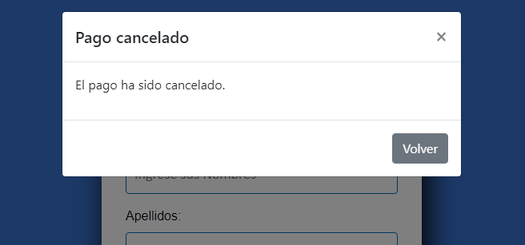

VER: https://hostnation.store/carpetaPaypal/checkout/paypal.php

Descripción del Proyecto:

Este proyecto consiste en el desarrollo de un formulario para realizar compras a través de PayPal. A continuación, se describe el código y su funcionamiento en las diferentes partes del proyecto:

1. Estructura del Código:

El proyecto consta de 2 archivos PHP (paypal.php y aprobado.php) y un archivo CSS.

2. Creación del archivo PAYPAL.php:

Importación de recursos: El código comienza importando diferentes recursos necesarios, como hojas de estilo CSS y bibliotecas de Bootstrap y PayPal.

Definición de variables: Se define una variable $monto en PHP que se utilizará para almacenar el valor del monto de la compra. Si el parámetro amount se encuentra en la URL y es numérico, se asigna a la variable $monto; de lo contrario, se establece un valor predeterminado de 20.

Formulario de compra: El código HTML contiene un formulario que incluye campos para ingresar nombres, apellidos, correo electrónico y el monto de la compra. Los campos están asociados con identificadores únicos para su posterior manipulación con JavaScript.

Botones para ajustar el monto: Se agregan botones de incremento y decremento que llaman a funciones JavaScript incrementMonto() y decrementMonto() respectivamente, para aumentar o disminuir el valor del campo de monto.

Contenedor del botón de pago de PayPal: Se incluye un div con el id paypal-button-container donde se renderizará el botón de pago de PayPal.

Scripts JavaScript:

Incremento y decremento del monto: Se definen las funciones incrementMonto() y decrementMonto() para aumentar y disminuir el valor del campo de monto respectivamente.

Configuración del botón de pago de PayPal: Se utiliza la biblioteca de PayPal para crear y configurar el botón de pago. Se establece un estilo personalizado y se definen las funciones createOrder(), onApprove() y onCancel() para gestionar la creación del pedido, la aprobación del pago y la cancelación del pago respectivamente.

3. Creación del archivo APROBADO.php:

Página de confirmación: El código HTML muestra una página sencilla de confirmación de compra aprobada. Contiene un título, un mensaje de agradecimiento y un botón para volver al formulario principal.
Estilos CSS: Se utiliza una clase contenedor para establecer los estilos visuales del contenedor principal, y una clase boton para los estilos del botón de volver.

4. Creación del archivo STYLE.css:

Definición de estilos generales: Se establecen estilos generales para el cuerpo (body) de la página, como el fondo y las fuentes.
Estilos del formulario de compra: Se definen estilos para el contenedor del formulario (form-register), incluyendo su tamaño, fondo, margen y sombra. También se definen estilos para los campos de entrada (controls), estableciendo su ancho, fondo, borde y fuente.
Estilos de la página de confirmación: Se definen estilos para el contenedor principal (contenedor), estableciendo su tamaño, fondo, margen y fuente. También se definen estilos para el título (h2) y el mensaje de agradecimiento (p), y se establecen estilos para el botón de volver (boton).

